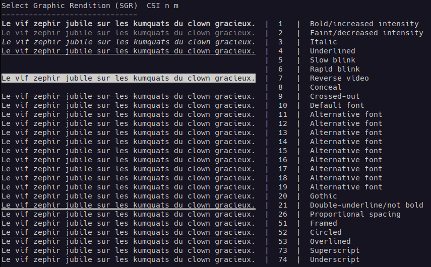
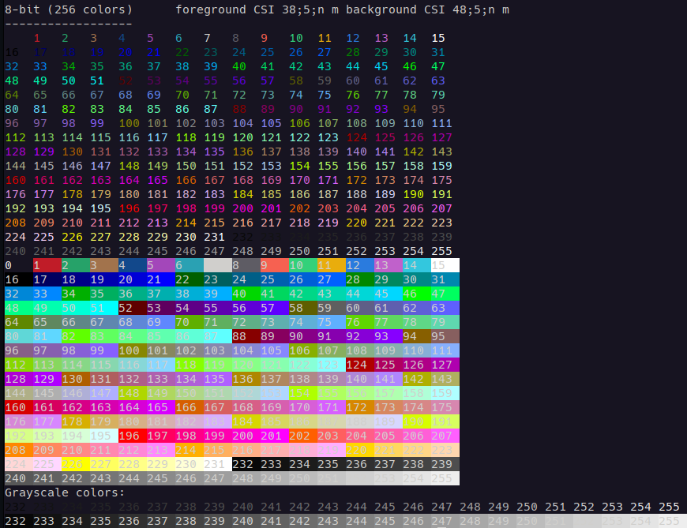

# ANSI-escape-sequences
This little program shows what is the ANSI escape sequences.
It displays text decoration and foreground/background colorization in different color encodings.
It shows what the ANSI code is capable of.

